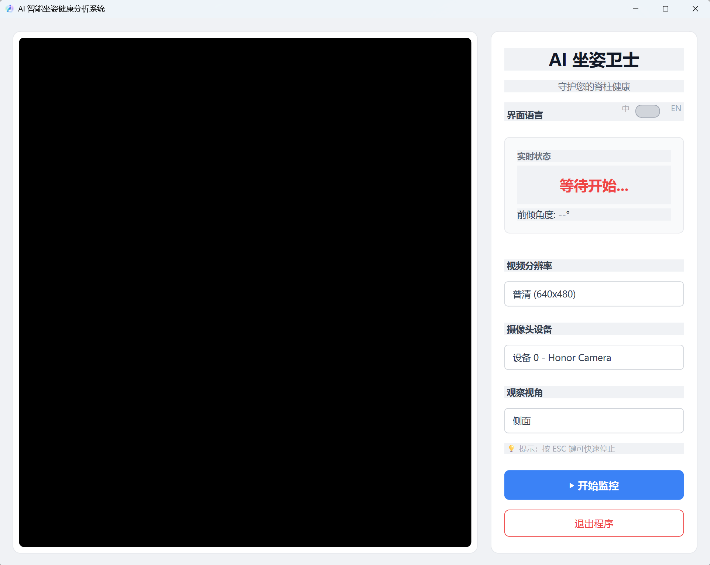
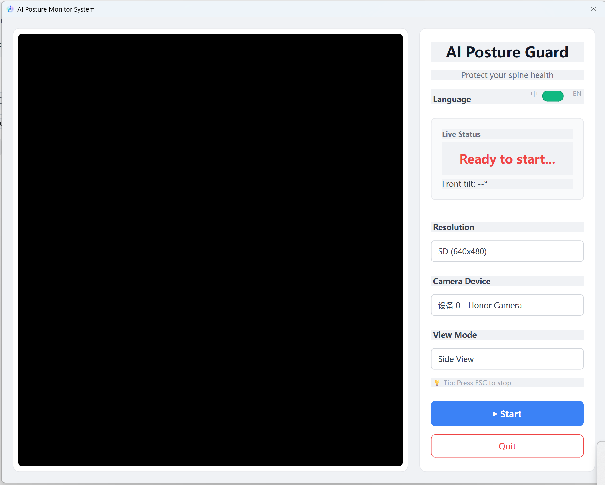

# Posture Monitor / 姿态监测工具

A desktop application that uses computer vision to monitor body posture in real time using a webcam.
一个使用摄像头进行 **实时姿态检测** 的桌面程序，用于帮助用户保持良好的坐姿。

The program uses **MediaPipe**, **OpenCV**, and **PyQt6** to detect human pose landmarks and display posture feedback.




---

# Features / 功能

### English

* Real-time posture monitoring
* Webcam-based human pose detection
* Visual feedback on posture
* Desktop GUI interface
* Lightweight and easy to run

### 中文

* 实时坐姿监测
* 使用摄像头进行人体姿态识别
* 提供姿态反馈提示
* 图形界面操作
* 轻量级桌面应用

---

# Requirements / 环境要求

Python version:

```
Python 3.12
```

Install dependencies:

```bash
pip install -r requirements.txt
```

Example `requirements.txt`:

```txt
mediapipe
opencv-contrib-python
numpy
Pillow
PyQt6
pywin32; platform_system == "Windows"
```

---

# Project Structure / 项目结构

```
posture-monitor/
│
├── poseture_monitor.py
├── pose_landmarker_lite.task
├── requirements.txt
├── README.md
└── icon.ico
```

---

# Run the Program / 运行程序

### English

Run the Python script:

```bash
python poseture_monitor.py
```

The application will open a window and start webcam posture monitoring.

### 中文

运行程序：

```bash
python poseture_monitor.py
```

程序会打开图形界面，并开始通过摄像头检测人体姿态。

---

# Build Executable (Optional) / 打包为EXE（可选）

You can package the program using **PyInstaller**.

### English

```bash
pyinstaller poseture_monitor.py ^
--onefile ^
--windowed ^
--icon=icon.ico ^
--add-data "pose_landmarker_lite.task;." ^
--collect-all numpy ^
--collect-all mediapipe ^
--collect-all cv2
```

### 中文

使用 PyInstaller 打包：

```bash
pyinstaller poseture_monitor.py ^
--onefile ^
--windowed ^
--icon=icon.ico ^
--add-data "pose_landmarker_lite.task;." ^
--collect-all numpy ^
--collect-all mediapipe ^
--collect-all cv2
```

生成的可执行文件会在：

```
dist/
```

目录中。

---

# Notes / 注意事项

### English

* A webcam is required.
* Ensure the file `pose_landmarker_lite.task` is in the same directory as the script.
* Good lighting improves pose detection accuracy.

### 中文

* 需要电脑摄像头。
* `pose_landmarker_lite.task` 必须与程序在同一目录。
* 光线充足可以提高姿态检测准确率。

---

# License / 许可证

This project is provided for educational and personal use.

本项目仅用于学习和个人使用。

---

